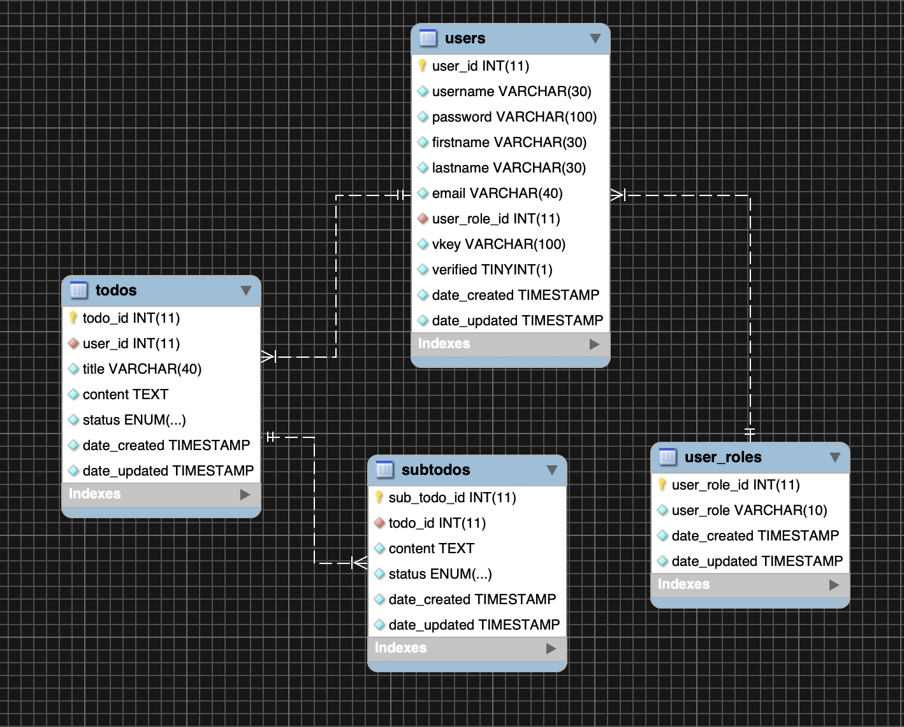

# TODO App
##Instructions
1. Import the backup database file found in SQL_Backup directory.
If you use XAMPP go to phpmyadmin page and create a database and then import the SQL file.
If you use MySQL application go to the terminal then log in to your mysql and create a database.
After that exit mysql then do this command ```mysql -u username -p dbname < Tododb.sql```
_Note you can simply drag the file to the terminal to automate the location of the file._

To config the database go model/config.php. Provide your info of your database.

To run the application without XAMPP, first you need PHP on your computer. Open the terminal to where application is located.
then run this command ```php S 127.0.0.1:8080 -t `pwd` ``` 
**Admin**
2. Admin is already created and you access its account username: admin & pass: admin.
3. Login to view the created users.
4. To view/edit his/her account, click on the 'edit' icon which is the **2nd blue button** in the table.
5. To delete user, click on the 'delete' icon which is the **3rd red button** in the table.
6. To view user todos, click on the 'info' icon which is the **1st blue button** in the table.
**User**
7. Create new account and wait for email verification.
8. To add task, click on add task on the upper left corner.
9. Create your title and your todos for your task.
10. To view, click on the 'info' icon which is the **1st blue button** in the table.
11. To update, click on the 'edit' icon which is the **2nd blue button** in the table.
12. To delete, click on the 'delete' icon which is the **3rd red button** in the table.

<hr />

###TODOapp ERD



### Notes
- Admin can't update it's own password.
- User need to register and verify his/her email.
- User can't update password only the Admin can.
- There is no soft delete both users and todos.


## C.R.U.D
### User
1. Create Todo
	- Title
	- Content
2. Read Todo
	- Date created and updated
	- Title
	- Status
	- Content
3. Update Todo
	- Display date created and updated
	- Title
	- Status
	- Content
	- Automatic datetime updated
4. Delete Todo

### Admin
* **For User Account**
	1. Read User
		- Date created and updated
		- User ID
		- Fullname
		- Username
	2. Update User
		- Display date created and updated
		- Firstname
		- Lastname
		- Username
		- Password
		- Automatic datetime updated
	3. Delete User
* **For User Todo**
	1. Create User Todo
		- Title
		- Content
	2. Read User Todo
		- Display date created and updated
		- Title
		- Status
		- Content
	3. Update User Todo
		- Display date created and updated
		- Title
		- Status
		- Content
		- Automatic datetime updated
	4. Delete User Todo
