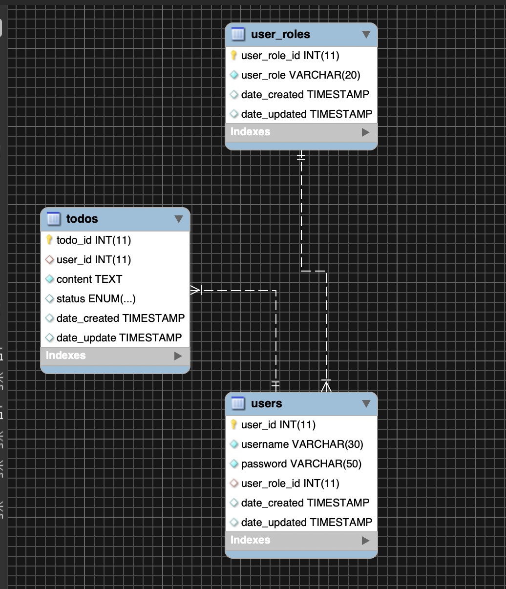

# TODO App
Here is my ERD

### Notes
- Admin is already created.
- Admin can't update it's own password.
- Users need to register.
- Users can't update password only the Admin can.

## C.R.U.D
### User
1. Create Todo
2. Read Todo
3. Update Todo
4. Delete Todo

### Admin
* **For User Account**
	1. Read User
	2. Update User
	3. Delete User
* **For User Todo**
	1. Create User Todo
	2. Read User Todo
	3. Update User Todo
	4. Delete User Todo
